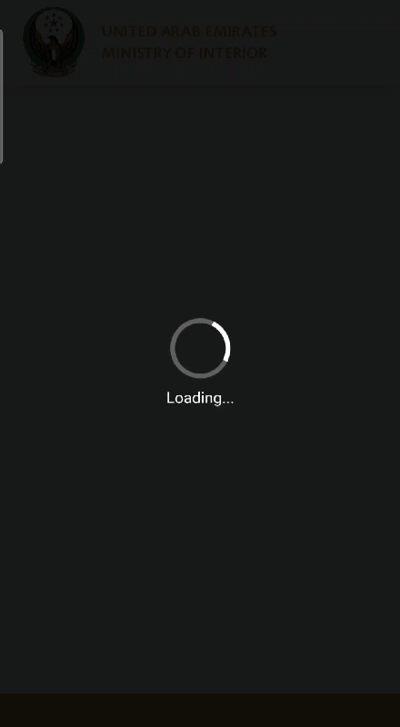
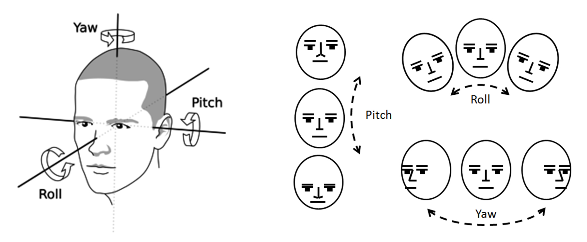

<div>
<h1>Live Face Capture</h1>
<br>

<div align="center">
  </a>
</div>
<!--  -->

<h2>Overview</h2>
This JavaScript library is designed to capture an optimal facial image for applications requiring precise, frontal, and upright face alignment. It is particularly useful in scenarios such as face recognition, gender and face expression analysis, and other tasks that depend on accurate facial positioning.

The library ensures high-quality image capture by assessing two critical factors:

1. Face distance from the camera.
2. Real-time facial orientation, evaluated in three dimensions:
    - Yaw: Rotation side-to-side.
    - Pitch: Up-and-down tilt.
    - Roll: Left-to-right tilt.
    
To enhance the reliability of captured images, the system also incorporates liveness detection based on the identification of natural actions like eye blinks to confirm the subject is a real person.

<br>
<!-- <div align="center">
  </a>
  <br>
  Fig 1: Three different types of orientations along x-axis, y-axis and z-axis
</div> -->


<br>


<h2>Core Technology</h2>
The solution is built on MediaPipe Face Mesh, a robust framework that maps 468 3D facial landmarks with high precision. These landmarks form the basis for estimating facial orientation and eyes blink detection.

<h3>Key Features</h3>

- <b>Orientation Estimation</b><br>
The system calculates Pitch, Yaw, and Roll angles to determine the face’s position relative to the camera. The output values range from -90° to 90°, with 0° representing an ideal, perfectly aligned face.

- <b>Liveness Detection</b><br>
To ensure the face is genuine and not an image or mask, the system detects eye blinks in real time, reinforcing the capture’s authenticity.

- <b>Face Distance</b><br>
The system ensures the face is neither too far nor too close to the camera by analyzing the ratio between the face-oval area and the camera-hole area. This helps maintain a consistent and ideal distance for capturing high-quality images.

- <b>Face Position</b><br>
To ensure proper alignment, the system monitors whether the face is centered within the camera view. It checks if the face is drifting out of the camera-hole range, guaranteeing accurate placement in every capture.

- <b>Visualization</b><br>
A comprehensive visualization feature has been integrated to help track real-time orientation estimations. This allows users to adjust and align their faces effectively to meet the required thresholds.

</div>

<br>

## <div>Quick Start Examples</div>

<details open>
<summary><h4><b>Build Library</b></h4></summary>

```bash
$ cd face-capture-library
$ npm install
$ npm run build
```

After successfull build, you can find `live-face-capture.js` and `live-face-capture.min.js` exported to `./dist` directory.

</details>


<details open>
<summary><h4><b>Import Library</b></h4></summary>

```bash
# import the library in html
<script src="./dist/live-face-capture.min.js"></script>

# import the library in javascript
import LiveFaceCapture from "./dist/live-face-capture.min.js";
```

<summary><h4><b>Use Library</b></h4></summary>

```bash
# get list of available camera devices
const devices = await navigator.mediaDevices.enumerateDevices();
const videoInputs = devices.filter(device => device.kind === "videoinput");
console.log("Devices from Index:", videoInputs);

# Use the library
LiveFaceCapture.open({
    config: {
        is_front_camera: true,
        camera_id: videoInputs[0].deviceId,
        allow_multiple_faces: false,
        max_camera_res: 1920,
        time_to_blink: 1500,
        min_face_detection_conf: 0.5,
        face_area_thres: 0.3,
        pitch_thresh: 15,
        yaw_thresh: 15,
        roll_thresh: 15,
        blink_eye_frames: 2,
        encrypt: false,
    },
    style: {
        vis: true,
        hole_height: 0.7,
        hole_width: 0.7,
        doc_color: 'white',
        doc_opacity: 1.0,
        face_color_success: 'rgba(0, 255, 0, 1)',
        face_color_fail: '#ff0000',
        font_size: null,
    },
    onCaptureComplete: (results) => {
        console.log(results);
        const imgPrev = document.getElementById("preview");
        imgPrev.src = results.best_frame;
        imgPrev.style.display = "flex";
    },
    onError: (error) => {
        console.log(error);
    },
    onClose: () => {
        console.log("Everything Shutdown...");
    }
});

```

<summary><h4><b>Shutdown Library</b></h4></summary>

```bash
# We can disengage camera and delete SDK from the UI by calling LiveFaceCapture.close() explicitly within the code. Returns a promise with result = [true, false]

LiveFaceCapture.close().then((result) => {
    console.log("Shutdown Status:", result);
})
```
</details>


<details open>
<summary><h3><b>Library Configurations</b></h3></summary>
All possible configuration has been given in the code block above. Following is the breif explaination for every parameter:

<br>
<h3>General Configurations</h3>

* <b>is_front_camera: </b>Specifies camera type (front/back) for the requested camera device. Only applicable if the system fails to identify itself. Default `true`.

* <b>camera_id: </b>Specifies which camera to use based on the `deviceId`. camera_id can be any from the list of avaliable devices using `navigator.mediaDevices.enumerateDevices()` OR index of the list e.g. 0, "1" etc. If camera_id is not specified, the first camera available from the list will be initialized. Camera index `0` is used by default.

* <b>allow_multiple_faces: </b>Determines if multiple faces are allowed in the captured photo. Default `false`.

* <b>max_camera_res: </b>Limits the camera resolution for better performance. Default `1920`.

* <b>time_to_blink: </b>The time in milliseconds between achieving a valid face position and prompting the user to blink. Default `1500 ms`.

* <b>min_face_detection_conf: </b>The confidence threshold for Mediapipe Face Detection. Faces below this threshold are ignored. Default `0.5`.

* <b>face_area_thres: </b>The minimum ratio between the face-oval area and the camera-hole area. If the ratio is below this value, the face is considered too far. Default `0.3` (face area should be atleast 30% of the hole area).

* <b>pitch_thresh: </b>The valid range for the pitch angle (up-down tilt). Default `±15° (range: -15° to +15°)`.

* <b>yaw_thresh: </b>The valid range for the yaw angle (side-to-side rotation). Default `±15° (range: -15° to +15°)`.

* <b>roll_thresh: </b>The valid range for the roll angle (left-right tilt). Default `±15° (range: -15° to +15°)`.

* <b>blink_eye_frames: </b>The number of consecutive frames during which eyes must remain closed to register a blink. Default `2`.

* <b>encrypt: </b>Encrypted base64 of captured image will be returned in `onCaptureComplete` callback if specified. Default `false`.


<h3>Styling</h3>

* <b>vis: </b>Toggles visualization of 3D face landmarks and the face bounding box. Default true.

* <b>hole_height: </b>Height of the camera-hole as a percentage of the camera view container. Default `0.7`.

* <b>hole_width: </b>Width of the camera-hole as a percentage of its height. Default `0.7`.

* <b>doc_color: </b>The background color of the camera view outside the camera-hole. Default `white`.

* <b>doc_opacity: </b>Opacity of the background color outside the camera-hole. Default `1.0`.

* <b>face_color_success: </b> Color of the camera-hole border and message text when the face meets success criteria. Default `rgba(0, 255, 0, 1)`

* <b>face_color_faile: </b> Color of the camera-hole border and message text when the face fails the checks. Default `#ff0000`

* <b>font_size: </b> Integer value specifying font size in pixels. System estimates the best size if font_size is not speicified or null. Default `null`


<h3>Callbacks</h3>

* <b>onCaptureComplete: </b>Triggered when a successful capture is completed. Returns a results object containing: base64_string of the captured image and, face bounding box information.

* <b>onError: </b>Triggered when an internal error occurs. Receives an error message as a parameter.

* <b>onClose: </b>Triggered after a successful capture, releasing the camera and memory. The library must be re-initialized after this callback.

</details>

## <div>Author</div>

Muhammad Nouman Ahsan

## <div>References</div>

1. Mediapipe https://google.github.io/mediapipe/
2. Mediapipe Github https://github.com/google/mediapipe
3. In-plane face orientation estimation in still images https://hal.archives-ouvertes.fr/hal-01169835/
4. Real-Time Eye Blink Detection using Facial Landmarks https://vision.fe.uni-lj.si/cvww2016/proceedings/papers/05.pdf

